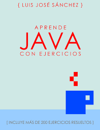

# Ejercicios de Programación de 1º DAM
Ejercicios de la asignatura Programación **1º DAM (Desarrollo de Aplicaciones Multiplataforma)** del IES Campanilla.

## :computer: ¿Qué se aprende en Programación?

* Comando de linux  :penguin:
* Git y GitHub :octocat:
* Lenguaje Java :coffee:: variables, vucles, p00 etc. 

## :wave::earth_africa: "Hola Mundo" en java

A continuación se muestra el programa "Hola Mundo" escrito en lenguaje java

```java
/**
 * Muestra por pantalla la frase "¡Hola mundo!"
 *
 * @author Christian Amo
 */

public class HolaMundo { // Clase principal
  public static void main(String[] args) {
    System.out.println("¡Hola mundo!");
  }
}
```
Para compilar el programa teclea:

```console
javac HolaMundo.java
```

Para ejecutar el programa usamos el comando `java`:

```console
java HolaMundo
```

## :books: Bibliografía


[Aprende java con Ejercicios](https://leanpub.com/aprendejava)

## :globe_with_meridians: Enlaces de interés

* [Página oficial del IES Campanillas](https://iescampanillas.com/):bell:

* [Guía de la asignatura de Programación](https://github.com/luisjosesanchez/programacion)
